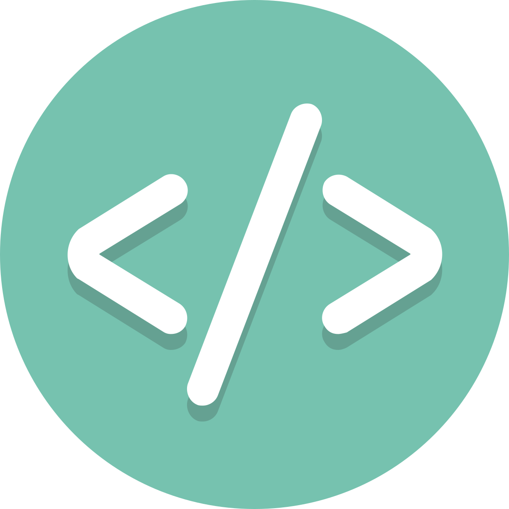

<div align="center">
<a href="https://semsem.dev"></a>
</div>

<div align="center">
<h1>Hassan Elseoudy (semsem.dev)</h1>
<p>My personal portfolio website</p>
</div>

# Tech Stack

- [NextJS][nextjs] - UI framework
- [Vercel][vercel] - Hosting
- [TailwindCSS][tailwind] / CSS - Styling and UI
- [Framer Motion][framer] - Animations
- [Umami][umami]: Analytics
- [Next Themes][nexttheme]: Color Theme
- [GitHub Actions][gh-actions]: CI/CD and Deployment

## Run Project Locally

Follow this guide to get this site running locally:

### 1. Clone Repository

```bash
git clone https://github.com/semsem-dev/semsem-dev.github.io.git
cd semsem-dev.github.io
```

### 2. Install Dependencies

```bash
npm install
```

### 3. Run Development Server

```bash
npm run dev
```

Visit [http://localhost:3000][localhost] to see the project live.

### Environment Variables

The following environment variables are optional but recommended for analytics:

- `NEXT_PUBLIC_UMAMI_WEBSITE_ID`: Your Umami website ID.

## Build

```bash
npm run build
```

## License & Usage

This portfolio is MIT-licensed so you are free to use it as an inspiration. Just make sure you link back to [semsem.dev][site] in the footer section as attribution to the original source.

<!-- Link Refs -->

[nextjs]: https://nextjs.org
[vercel]: https://vercel.com
[tailwind]: https://tailwindcss.com
[umami]: https://umami.is
[framer]: https://www.framer.com/motion/
[gh-actions]: https://github.com/features/actions
[nexttheme]: https://github.com/pacocoursey/next-themes
[site]: https://semsem.dev
[localhost]: http://localhost:3000
